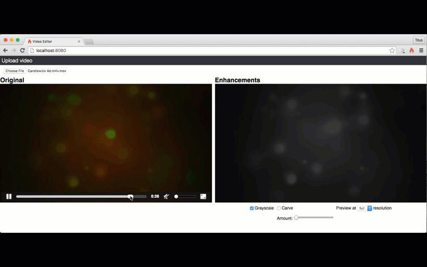

# Seam Express

For a class project, we decided to experiment with video processing in the browser. For the demo we have seam carving and grayscale filters that can be applied to the video in real-time.

## Sources

Seam carving algorithm: [http://nparashuram.com/seamcarving/](http://nparashuram.com/seamcarving/)

Inspiration and grayscale algorithm: [http://html5doctor.com/video-canvas-magic/](http://html5doctor.com/video-canvas-magic/)
